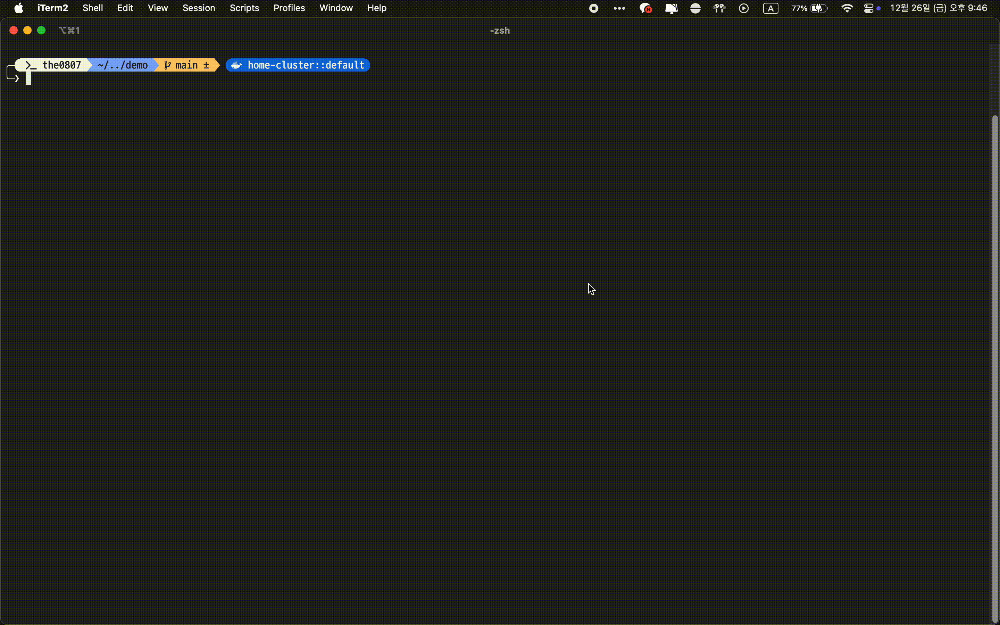
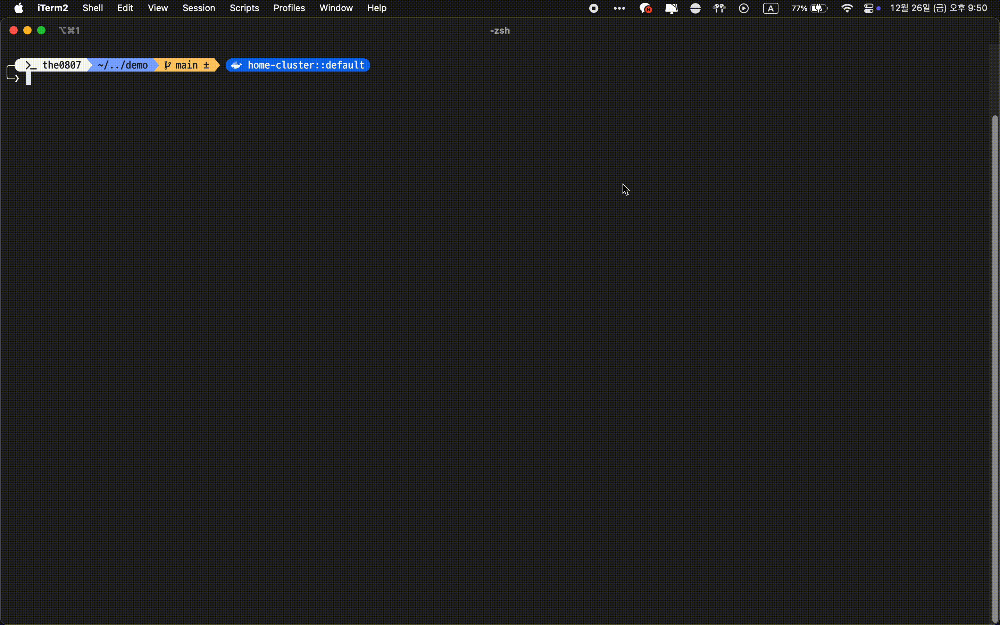

# 🔍 ff - Flexible File Finder

A powerful interactive file search and navigation tool using `fzf`. Seamlessly switch between file finding (by name) and content searching (by text) modes for fast and intuitive file exploration and editing.

<table>
  <tr>
    <td align="center"><b>Find Mode</b></td>
    <td align="center"><b>Grep Mode</b></td>
  </tr>
  <tr>
    <td></td>
    <td></td>
  </tr>
  <tr>
    <td align="center"><b>Change directory</b></td>
    <td align="center"><b>Open file</b></td>
  </tr>
  <tr>
    <td></td>
    <td></td>
  </tr>
</table>

## ✨ Features

- 🔄 **Dual Mode Operation**: Instantly switch between Find mode and Grep mode with a single `TAB` keypress
- 👀 **Live Preview**: Real-time file content preview with syntax highlighting
- 🎨 **Syntax Highlighting**: Beautiful code display using `bat`/`batcat`
- 🌳 **Directory Trees**: Visual directory structure using `eza` or `tree`
- ⚡ **Lightning Fast**: High-speed searching with `fd` and `ripgrep`
- 📝 **Editor Integration**: Direct file opening in VSCode or your preferred editor
- 🎯 **Jump to Line**: Navigate directly to matched lines in Grep mode
- 🔧 **Smart Fallbacks**: Works with standard Unix tools when optional dependencies aren't available
- 🎨 **Beautiful UI**: Polished interface with icons, colors, and intuitive controls

## 📋 Requirements

### Required
- **`fzf`** - Interactive fuzzy finder (core dependency)
- **Supported Shells**: Bash, Zsh, Fish

### Optional (Highly Recommended)
Install these for the best experience:

| Tool              | Purpose                           | Fallback                |
| ----------------- | --------------------------------- | ----------------------- |
| `fd`              | Fast file finder                  | `find`                  |
| `ripgrep` (rg)    | Lightning-fast content search     | `grep`                  |
| `bat` or `batcat` | Syntax-highlighted previews       | `cat`                   |
| `eza`             | Modern directory trees            | `tree` or basic display |
| `tree`            | Directory structure visualization | Basic display           |

> **Note:** To see icons in directory trees when using `eza`, you need to install a [Nerd Font](https://www.nerdfonts.com/). Popular choices include:
> - [JetBrains Mono Nerd Font](https://www.nerdfonts.com/font-downloads)
> - [Fira Code Nerd Font](https://www.nerdfonts.com/font-downloads)
> - [Hack Nerd Font](https://www.nerdfonts.com/font-downloads)
>
> After installation, configure your terminal to use the Nerd Font.

## 📦 Installing Dependencies

### macOS (Homebrew)
```bash
brew install fzf fd ripgrep bat eza tree
```

### Ubuntu/Debian
```bash
sudo apt update
sudo apt install fzf fd-find ripgrep bat eza tree
```

## 🚀 Installation

### Method 1: Quick Install (Recommended)

```bash
curl -fsSL https://raw.githubusercontent.com/the0807/ff/main/install.sh | bash
```

Then reload your shell:
```bash
source ~/.zshrc          # for zsh users
source ~/.bashrc         # for bash users
source ~/.config/fish/config.fish  # for fish users
```

### Method 2: Manual Install

1. **Download the script:**

**For Bash/Zsh:**
```bash
mkdir -p ~/.config/ff
curl -fsSL https://raw.githubusercontent.com/the0807/ff/main/ff.sh -o ~/.config/ff/ff.sh
```

**For Fish:**
```bash
mkdir -p ~/.config/ff
curl -fsSL https://raw.githubusercontent.com/the0807/ff/main/ff.fish -o ~/.config/ff/ff.fish
```

2. **Add to your shell configuration:**

**For Zsh** (`~/.zshrc`):
```bash
echo 'source ~/.config/ff/ff.sh' >> ~/.zshrc
source ~/.zshrc
```

**For Bash** (`~/.bashrc` or `~/.bash_profile` on macOS):
```bash
echo 'source ~/.config/ff/ff.sh' >> ~/.bashrc
source ~/.bashrc
```

**For Fish** (`~/.config/fish/config.fish`):
```fish
echo 'source ~/.config/ff/ff.fish' >> ~/.config/fish/config.fish
source ~/.config/fish/config.fish
```

## 📖 Usage

### Basic Commands

```bash
ff          # Start in Find mode (default)
ff find     # Start in Find mode (explicit)
ff grep     # Start in Grep mode
```

### Key Bindings

#### Common Controls
| Key      | Action                                             |
| -------- | -------------------------------------------------- |
| `Enter`  | Navigate to file/directory                         |
| `Ctrl-O` | Open file in editor (at matched line in Grep mode) |
| `TAB`    | Toggle between Find and Grep mode                  |
| `Ctrl-U` | Scroll preview up                                  |
| `Ctrl-D` | Scroll preview down                                |
| `Esc`    | Exit                                               |
| `Ctrl-C` | Cancel/Exit                                        |

#### Find Mode
- Type to fuzzy search by **filename**
- Press `Enter` to navigate to the selected file's directory
- Press `Ctrl-O` to open the file in your editor

#### Grep Mode
- Type to search by **file content**
- See matching files with line numbers and context
- Press `Enter` to navigate to the file's directory
- Press `Ctrl-O` to open the file at the matched line

## 🎨 Usage Examples

### Example 1: Quick File Search
```bash
$ ff
# Type "config" to fuzzy find files matching "config"
# Use arrow keys to select
# Press Enter to cd to the file's directory
# Or press Ctrl-O to open the file
```

### Example 2: Search Code Content
```bash
$ ff grep
# Type "function handleClick"
# See all files containing this text
# Files show with line numbers highlighted
# Press Ctrl-O to open in editor at that exact line
```

### Example 3: Dynamic Mode Switching
```bash
$ ff
# Start browsing files in Find mode
# Type "README" to find README files
# Press TAB to switch to Grep mode
# Type "installation" to search content
# Press TAB again to return to Find mode
```

### Example 4: Navigation Workflow
```bash
$ ff find
# Search for "utils.js"
# Press Enter to cd to the directory
$ pwd  # You're now in the file's directory
```

## ⚙️ Customization

### Change Default Editor

By default, `ff` uses VSCode (`code`) if available, otherwise falls back to `$EDITOR`. To customize:

```bash
# Add to ~/.zshrc or ~/.bashrc
export EDITOR=nvim     # Neovim
# or
export EDITOR=vim      # Vim
# or
export EDITOR=nano     # Nano
```

### Modify Search Behavior

Edit the `ff.sh` file to customize:
- FZF options (layout, theme, colors)
- Preview window size and position
- Key bindings
- Search commands

## 🎯 How It Works

### Find Mode
1. Uses `fd` (or `find`) to list all files and directories
2. Pipes results to `fzf` for interactive filtering
3. Shows file previews using `bat` (with syntax highlighting)
4. Shows directory trees using `eza` or `tree`

### Grep Mode
1. Uses `ripgrep` (or `grep`) to search file contents as you type
2. Results show filename, line number, and matched content
3. Preview highlights the matched line in context
4. Opening with `Ctrl-O` jumps directly to the matched line

## 🔧 Troubleshooting

### "fzf not found" error
```bash
# Check if fzf is installed
which fzf

# If not installed, install it:
# macOS
brew install fzf

# Ubuntu/Debian
sudo apt install fzf
```

### Preview not displaying properly
Install the optional tools for better previews:
```bash
# macOS
brew install bat eza tree

# Ubuntu/Debian
sudo apt install bat eza tree
```

### Editor not opening files
Check your `EDITOR` environment variable:
```bash
echo $EDITOR

# If empty or not your preferred editor, set it:
export EDITOR=vim  # or your preferred editor
```

### VSCode not opening at the correct line
Ensure VSCode command-line tools are installed:
1. Open VSCode
2. Press `Cmd+Shift+P` (macOS) or `Ctrl+Shift+P` (Linux/Windows)
3. Type "Shell Command: Install 'code' command in PATH"
4. Select it and restart your terminal

## 🤝 Contributing

Contributions are welcome! Feel free to:
- 🐛 Report bugs by opening an issue
- 💡 Suggest new features
- 🔧 Submit pull requests
- 📖 Improve documentation

## 📄 License

MIT License - Feel free to use, modify, and distribute.

## 🙏 Acknowledgments

This project is built on top of these excellent tools:
- [fzf](https://github.com/junegunn/fzf) - Command-line fuzzy finder
- [fd](https://github.com/sharkdp/fd) - Fast and user-friendly alternative to find
- [ripgrep](https://github.com/BurntSushi/ripgrep) - Recursively search directories for regex patterns
- [bat](https://github.com/sharkdp/bat) - Cat clone with syntax highlighting
- [eza](https://github.com/eza-community/eza) - Modern replacement for ls

## 💡 Tips & Tricks

### Tip 1: Quick Project Navigation
```bash
# From anywhere in your project
ff
# Type the filename you want to work on
# Press Enter to navigate there
# Your shell is now in that directory!
```

### Tip 2: Finding TODO Comments
```bash
ff grep
# Type "TODO"
# See all TODO comments across your codebase
# Press Ctrl-O to open and fix them
```

### Tip 3: Configuration File Hunting
```bash
ff
# Type "config"
# Quickly find all configuration files
```

### Tip 4: Searching for Functions
```bash
ff grep
# Type "function myFunction"
# Find where functions are defined
# Jump directly to the definition
```

## 📊 Performance

`ff` is designed to be fast even in large codebases:
- With `fd` and `ripgrep`: Handles repositories with 100,000+ files efficiently
- Real-time search results as you type
- Minimal memory footprint
- Works great on both small and large projects

---

**Happy file browsing! 🚀**
